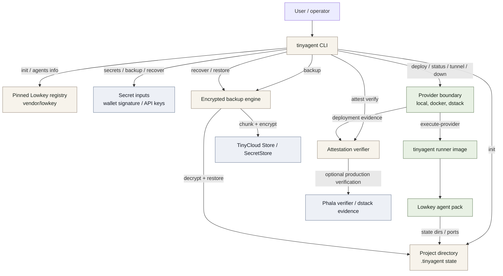

# TinyAgent Flow

## Current Trust Boundary

- Local and Docker provider flows are exercised by automated tests.
- The `dstack-cvm` provider path is wired through the Phala CLI, but production dstack deployment evidence still requires live credentials and service access.
- The package-local dstack simulator is useful for provider contract tests and must not be documented as production behavior.
