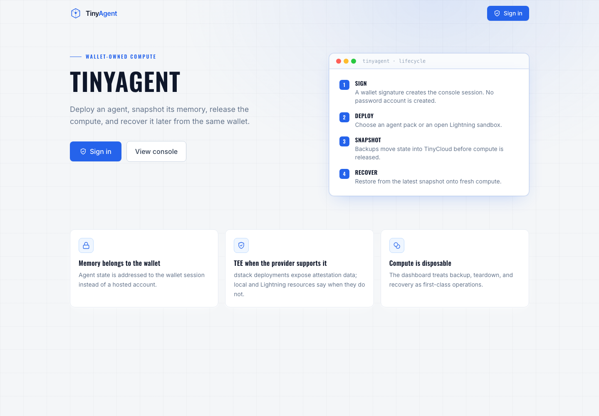
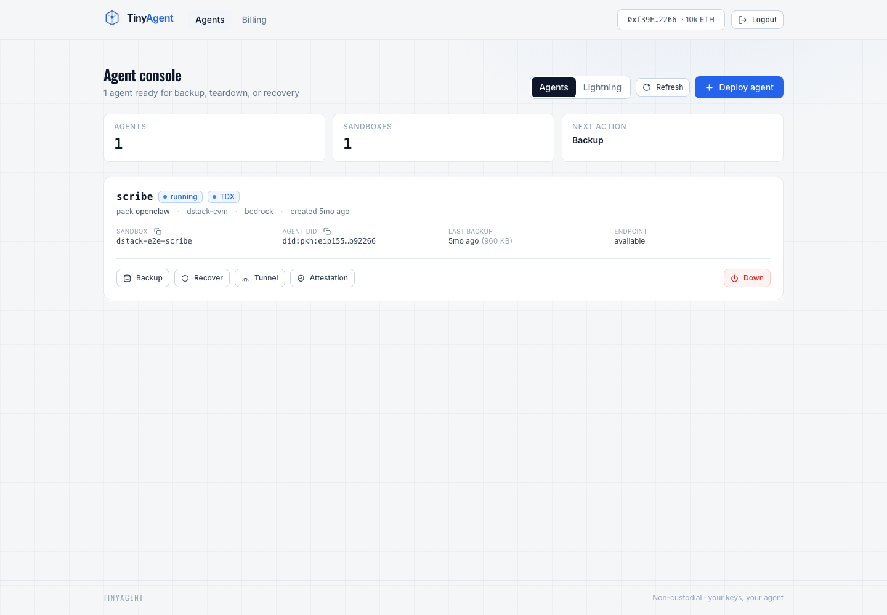
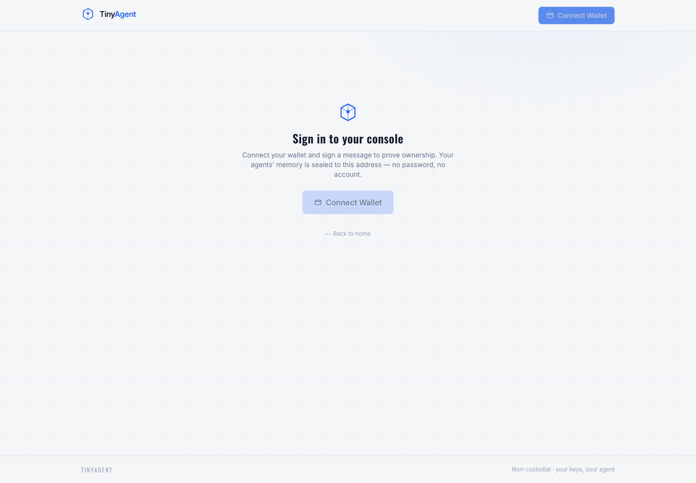
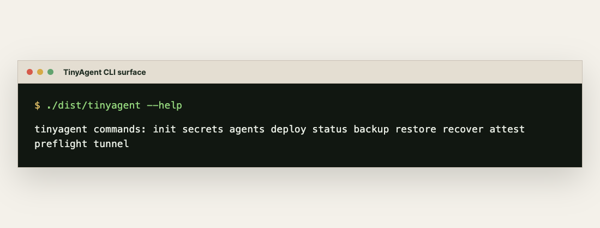
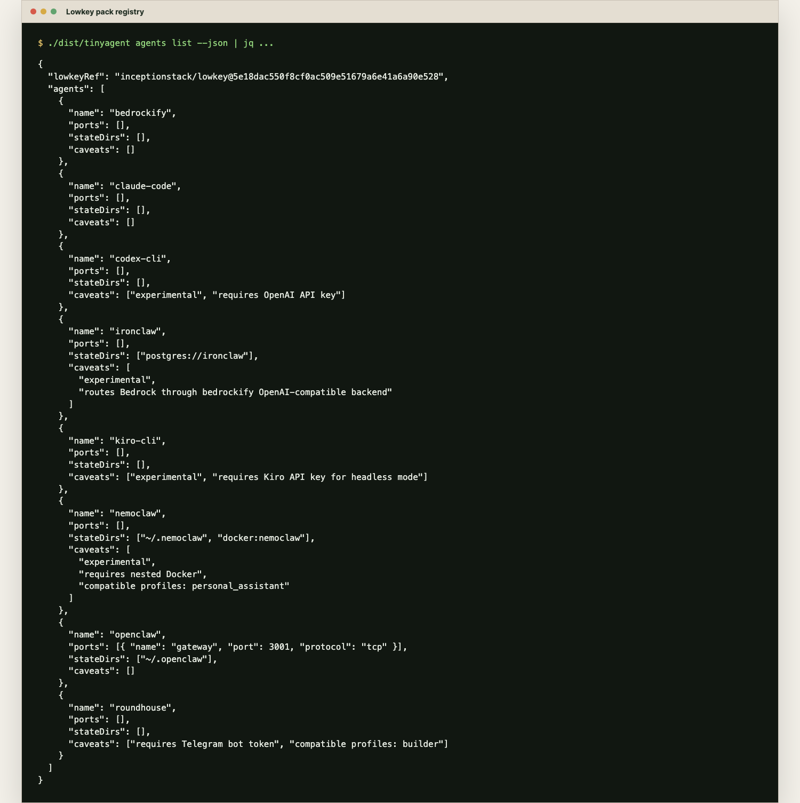
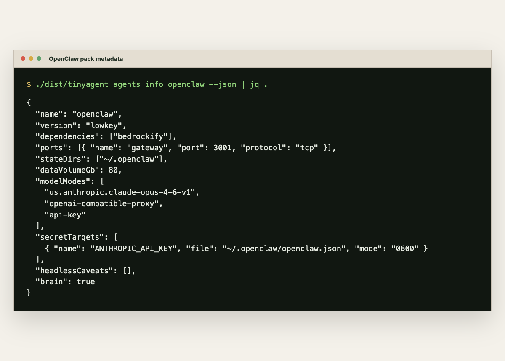
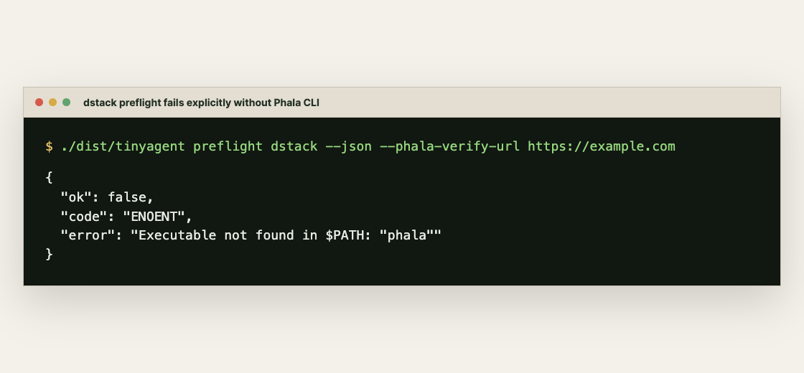

# TinyAgent Screenshots

These images are rendered from actual TinyAgent CLI output after `bun run build`.

## Web Console

The authenticated dashboard is captured against the local E2E control-plane and
Anvil wallet flow. The no-backend screenshot remains as the signed-out gate.

## CLI Surface

## Pack Registry

## OpenClaw Metadata

## dstack Preflight

Runtime console notes from the web screenshot run are preserved in `screenshots/web-console-console.log`.
