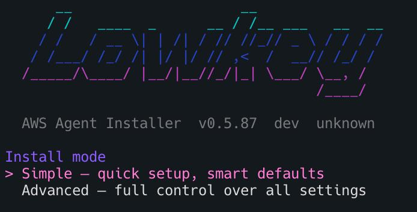
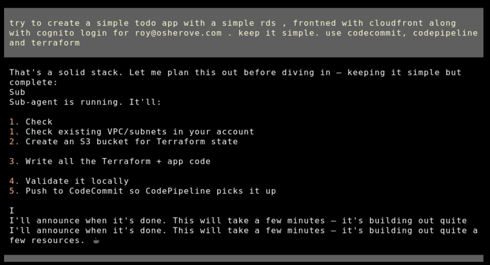
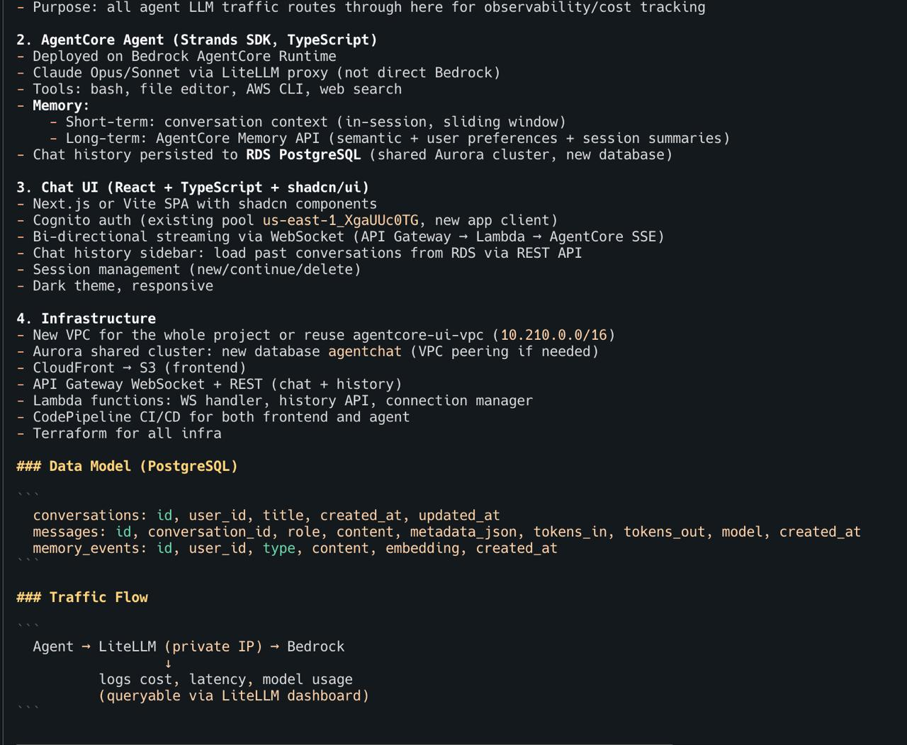
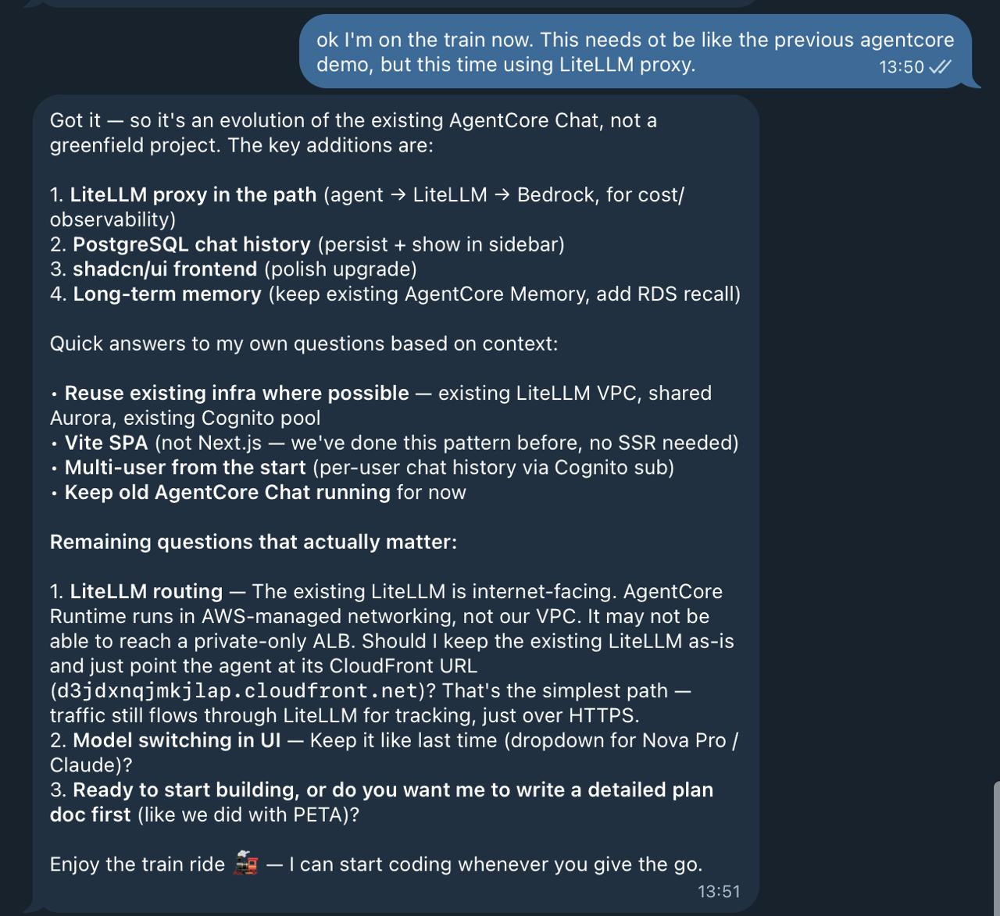
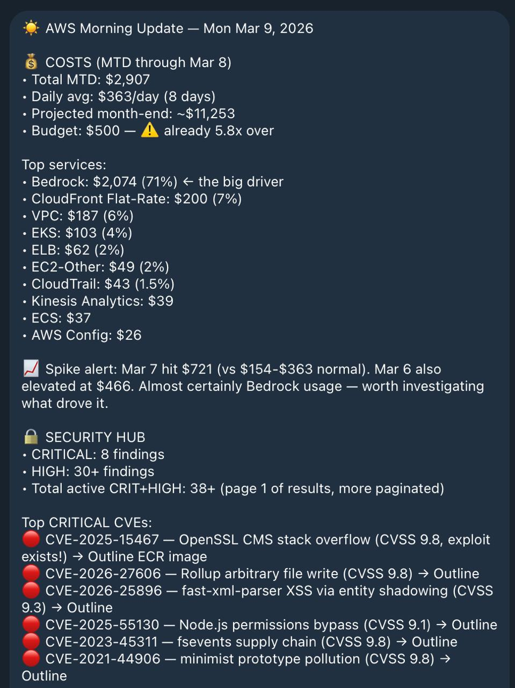
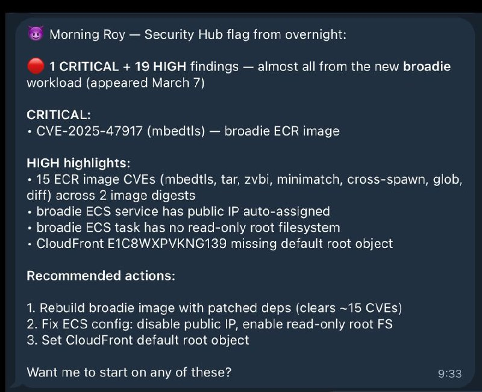
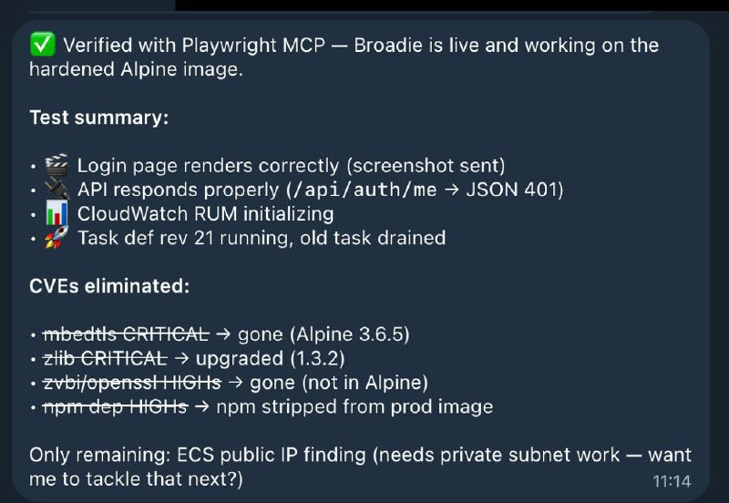
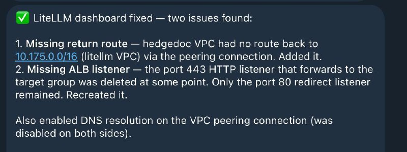

# Self-Hosted AI Coding Agents on AWS — OpenClaw, Claude Code, Codex, Kiro, NemoClaw, Hermes
[](https://www.youtube.com/watch?v=dJSk8DYlHvI)

▶️ [Watch the full walkthrough on YouTube](https://www.youtube.com/watch?v=dJSk8DYlHvI)

📝 [Read the blog post: "I Gave My Agent Its Own AWS Account"](https://robotpaper.ai/i-gave-my-agent-its-own-aws-account-and-now-it-codes-deploys-and-debugs-full-stack-apps/)

> **TL;DR — deploy Lowkey:**
>
> ```sh
> curl -sfL install.lowkey.run | bash
> ```
>
> Works in **bash**, **zsh**, and **AWS CloudShell**. The installer walks you through pack, profile, and deploy method interactively.
>
> 
>
> **One-liner examples (non-interactive):**
> ```sh
> # Full builder agent (can create/modify/delete AWS resources)
> curl -sfL install.lowkey.run | bash -s -- -y --pack openclaw --profile builder
>
> # Read-only advisor (can see everything, change nothing)
> curl -sfL install.lowkey.run | bash -s -- -y --pack openclaw --profile account_assistant
>
> # Personal assistant (Bedrock only, no AWS access)
> curl -sfL install.lowkey.run | bash -s -- -y --pack claude-code --profile personal_assistant
>
> # Sandboxed personal assistant (NemoClaw — isolated in OpenShell sandbox)
> curl -sfL install.lowkey.run | bash -s -- -y --pack nemoclaw --profile personal_assistant
>
> # Kiro CLI agent (AWS agentic IDE — requires interactive login after deploy)
> curl -sfL install.lowkey.run | bash -s -- -y --pack kiro-cli --profile builder
>
> # Codex CLI agent (OpenAI — builder agent, no Bedrock)
> curl -sfL install.lowkey.run | bash -s -- -y --pack codex-cli
> # After deploy, SSM into the instance and run: codex login
> # (ChatGPT/browser OR API key — your choice)
> ```
>
> Requires: AWS CLI + admin access on a **dedicated sandbox account**.
>
> ⚠️ Deploy in a clean account — LLMs make mistakes, a sandbox limits the blast radius.
>
> **Uninstall:** `curl -sfL uninstall.lowkey.run | bash`

---

## Getting Started

### Step 1: Install Lowkey

Run `curl -sfL install.lowkey.run | bash` — the installer walks you through **pack**, **profile**, **instance size**, and **deploy method** (CloudFormation or Terraform).

> **📊 Telemetry opt-out:** The installer sends anonymous install telemetry (start/success/failure + OS/arch/duration — no code, credentials, IPs, or hostnames). To opt out before installing:
> ```bash
> mkdir -p ~/.lowkey && touch ~/.lowkey/telemetry-off
> ```
> Or set `LOWKEY_TELEMETRY=0` when running the installer. [Full privacy details →](https://docs.lowkey.run/reference/telemetry-privacy)

**CLI flags for non-interactive deploys:**

| Flag | Description |
|------|-------------|
| `--non-interactive` | Skip all prompts, use defaults (aliases: `--yes`, `-y`) |
| `--pack <name>` | Agent pack: `openclaw`, `claude-code`, `hermes`, `nemoclaw`, `kiro-cli`, `codex-cli`, `pi`, `ironclaw`, `roundhouse` |
| `--profile <name>` | Permission profile: `builder`, `account_assistant`, `personal_assistant` |
| `--method <method>` | Deploy method: `cfn` (CloudFormation), `terraform` / `tf` |

**Permission profiles:**

| Profile | IAM | Instance | Use case |
|---------|-----|----------|----------|
| 🔴 `builder` | AdministratorAccess | t4g.xlarge | Build apps, deploy infra, manage pipelines |
| 🟡 `account_assistant` | ReadOnlyAccess + Bedrock | t4g.medium | Cost analysis, architecture review, debugging |
| 🟢 `personal_assistant` | Bedrock only | t4g.medium | Writing, research, coding help, daily tasks |

**Agent packs:**
| Pack | Description | Instance | Data Volume |
|------|-------------|----------|-------------|
| **OpenClaw** (default) | Stateful AI agent with 24/7 gateway, persistent memory, Telegram/Discord/Slack | t4g.xlarge recommended | 80GB |
| **Claude Code** | Anthropic's coding agent — native Bedrock support, auto-updates, full tool access | t4g.large recommended | None needed (set to 0) |
| **Hermes** *(experimental)* | NousResearch CLI agent — lighter, terminal-focused, self-improving skills | t4g.medium sufficient | None needed (set to 0) |
| **Pi** *(experimental)* | Minimal terminal coding harness — read, write, edit, bash tools | t4g.medium sufficient | None needed (set to 0) |
| **IronClaw** *(experimental)* | Rust-based AI agent by NEAR AI — static binary, fast startup | t4g.medium sufficient | None needed (set to 0) |
| **NemoClaw** *(experimental)* | OpenClaw in NVIDIA OpenShell sandbox — Landlock + seccomp + netns isolation, Bedrock via bedrockify. `personal_assistant` profile only. | t4g.xlarge required | 80GB |
| **Kiro CLI** *(experimental)* | AWS agentic IDE terminal client with MCP server support. Uses own cloud inference (not Bedrock). Requires interactive SSO login after deploy. | t4g.medium sufficient | None needed (set to 0) |
| **Codex CLI** *(experimental)* | OpenAI's Codex coding agent — uses OpenAI API directly (no Bedrock). Configured as builder agent (danger-full-access). **After install completes**, SSM into the instance and run `codex login`. | t4g.medium sufficient | None needed (set to 0) |

The installer discovers packs dynamically and asks which to deploy. Experimental packs are clearly marked.

> **Works from AWS CloudShell!** You can run the installer directly from [AWS CloudShell](https://console.aws.amazon.com/cloudshell/) — no local setup needed. CloudShell already has AWS credentials configured via your console session. If you pick Terraform as the deployment method, the installer will offer to install it automatically (no root required).

<details>
<summary><strong>Manual deploy (alternative)</strong></summary>

```bash
# Clone
git clone https://github.com/inceptionstack/lowkey.git
cd lowkey/deploy/cloudformation

# Deploy (OpenClaw — default)
aws cloudformation create-stack \
  --stack-name my-loki \
  --template-body file://template.yaml \
  --parameters ParameterKey=EnvironmentName,ParameterValue=my-loki \
  --capabilities CAPABILITY_NAMED_IAM \
  --region us-east-1

# Deploy (Hermes — lighter alternative)
aws cloudformation create-stack \
  --stack-name my-hermes \
  --template-body file://template.yaml \
  --parameters \
    ParameterKey=EnvironmentName,ParameterValue=my-hermes \
    ParameterKey=PackName,ParameterValue=hermes \
    ParameterKey=InstanceType,ParameterValue=t4g.medium \
    ParameterKey=DataVolumeSize,ParameterValue=0 \
  --capabilities CAPABILITY_NAMED_IAM \
  --region us-east-1

# Wait ~10 min, then connect
aws ssm start-session --target <instance-id>

# Talk to your Lowkey
openclaw tui   # or use the alias: loki tui
```

Full deployment guide: [Deploying Lowkey on AWS](https://github.com/inceptionstack/lowkey/wiki/Deploying-Lowkey-on-AWS)

</details>

### Step 2: Run the Essential Bootstraps

> **Important — these reduce mistakes and improve agent behavior significantly.**

After connecting to Lowkey for the first time, run the essential bootstraps. These are located at: [`bootstraps/essential/`](https://github.com/inceptionstack/lowkey/tree/main/bootstraps/essential)

**Example prompt** — paste this into your Lowkey chat:

> *"Lowkey please bootstrap yourself based on this url https://github.com/inceptionstack/lowkey/tree/main/bootstraps/essential"*

Available essential bootstraps:

- **BOOTSTRAP-ALARMS** — Configures CloudWatch alarm monitoring
- **BOOTSTRAP-CODING-GUIDELINES** — Sets development standards and coding practices
- **BOOTSTRAP-DAILY-UPDATE** — Configures daily status update procedures
- **BOOTSTRAP-DIAGRAMS** — Enables architecture diagram generation
- **BOOTSTRAP-DISK-SPACE-STRAT** — Sets up disk space management strategy
- **BOOTSTRAP-MCPORTER** — Configures MCPorter for MCP tool management
- **BOOTSTRAP-MEMORY-SEARCH** — Enables persistent memory search functionality
- **BOOTSTRAP-PLAYWRIGHT** — Sets up Playwright browser automation
- **BOOTSTRAP-SECRETS-AWS** — Configures AWS secrets and credential management
- **BOOTSTRAP-SECURITY** — Establishes security protocols and guidelines

### Step 3: Run the Optional Bootstraps

> Nice to have — take a look and pick what fits your workflow.

After running essential bootstraps, run the optional bootstraps of your choice, located at: [`bootstraps/optional/`](https://github.com/inceptionstack/lowkey/tree/main/bootstraps/optional)

Available optional bootstraps:

- **BOOTSTRAP-GITHUBACTION-CODE-REVIEW** — Integrates GitHub Actions with automated code review
- **BOOTSTRAP-PIPELINE-NOTIFICATIONS** — Sets up CI/CD pipeline notifications
- **BOOTSTRAP-SKILLS** — Manual install / recovery for the loki-skills library (auto-installed by the `openclaw` pack)
- **BOOTSTRAP-WEB-UI** — Configures the web user interface
- **OPTIMIZE-TOO-LARGE-CONTEXT** — Optimization strategies for large context windows

### Step 4: Telegram Integration (if needed)

If you want to use Lowkey via Telegram, run the Telegram bootstraps located at: [`bootstraps/telegram/`](https://github.com/inceptionstack/lowkey/tree/main/bootstraps/telegram)

- **BOOTSTRAP-TELEGRAM** — Sets up basic Telegram bot integration
- **BOOTSTRAP-TELEGRAM-GROUP** — Configures Telegram group chat functionality

### Uninstall

Remove one or all Lowkey deployments from your account:

```sh
curl -sfL uninstall.lowkey.run | bash
```

Finds deployments by tag, lets you pick which to remove, deletes CloudFormation stacks or cleans up resources manually (Terraform deploys), and optionally removes state buckets/lock tables.

---

## Pack System

Lowkey uses a **pack-based architecture** for deploying different AI agent runtimes. Each pack is a self-contained module with its own install script, manifest, and resources.

### Available Packs

| Pack | Type | Description |
|------|------|-------------|
| `bedrockify` | Base (auto-installed) | OpenAI-compatible proxy for Amazon Bedrock. Runs as a systemd daemon on port 8090. Most agent packs depend on this. |
| `openclaw` | Agent | Full stateful AI agent with 24/7 gateway, persistent memory, multi-channel support (Telegram, Discord, Slack). Includes Claude Code. |
| `claude-code` | Agent | Anthropic's Claude Code CLI. Native Bedrock support (no bedrockify needed), auto-updates, full tool permissions. |
| `hermes` | Agent *(experimental)* | NousResearch Hermes CLI agent. Self-improving skills, learning loop, lightweight. Uses bedrockify for model access. |
| `pi` | Agent *(experimental)* | Pi Coding Agent. Minimal terminal coding harness with read, write, edit, bash tools. Pure Node.js. |
| `ironclaw` | Agent *(experimental)* | IronClaw by NEAR AI. Rust-based agent with shell/file tools, MCP support. Single static binary. |
| `nemoclaw` | Agent *(experimental)* | NemoClaw — OpenClaw inside an [NVIDIA OpenShell](https://github.com/NVIDIA/OpenShell) sandbox with Landlock, seccomp, and network namespace isolation. Inference routed through bedrockify on the host (no NVIDIA API key needed). **Only compatible with `personal_assistant` profile** — the sandbox blocks all AWS API access. Requires Docker + t4g.xlarge. |
| `kiro-cli` | Agent *(experimental)* | [Kiro CLI](https://kiro.dev/docs/cli) — AWS agentic IDE terminal client with MCP server support. Uses its own cloud inference (no Bedrock/bedrockify). Pre-installs AWS MCP servers (terraform, ecs, eks, core, docs). **Requires interactive SSO login after deploy:** `kiro-cli login --use-device-flow`. |
| `codex-cli` | Agent *(experimental)* | [Codex CLI](https://github.com/openai/codex) — OpenAI's coding agent. Connects directly to OpenAI's API (no Bedrock/bedrockify). Configured as builder agent (danger-full-access, never prompts). **Post-install step**: SSM into the instance and run `codex login` (interactive) — auth is intentionally deferred until after deploy. |
| `roundhouse` | Agent | [Roundhouse](https://github.com/inceptionstack/roundhouse) — Pi-based AI coding agent with Telegram channel. Uses native Bedrock SDK (no bedrockify). Requires `TelegramBotTokenSecret` and `TelegramUser` parameters. |

### How It Works

```
install.sh → picks pack → CFN/SAM/Terraform → EC2 instance
  └── bootstrap.sh --pack openclaw --region us-east-1 --model ...
        ├── Phase 1: System setup (SSM, Node.js, volumes)
        ├── Writes /tmp/loki-pack-config.json (packs read via jq)
        ├── Phase 2: Install deps (bedrockify) → Install pack (openclaw/hermes)
        └── Phase 3: Brain files, Claude Code, Bedrock check
```

Each pack reads only what it needs from the JSON config file. The bootstrap dispatcher resolves dependencies automatically from `packs/registry.yaml`.

### Standalone Pack Usage

Packs can also be run individually (e.g., on an existing EC2 instance):

```bash
# Install bedrockify + hermes manually
git clone https://github.com/inceptionstack/lowkey.git
cd lowkey

# Install bedrockify first (dependency)
bash packs/bedrockify/install.sh --region us-east-1 --port 8090

# Then install your agent pack
bash packs/hermes/install.sh --region us-east-1 --hermes-model anthropic/claude-opus-4.6

# Or for OpenClaw
bash packs/openclaw/install.sh --region us-east-1 --model us.anthropic.claude-opus-4-6-v1 --port 3001

# Or for NemoClaw (sandboxed OpenClaw — needs Docker, personal_assistant only)
bash packs/nemoclaw/install.sh --region us-east-1 --model us.anthropic.claude-sonnet-4-6 --profile personal_assistant

# Or for Kiro CLI (no bedrockify needed, requires interactive login after install)
bash packs/kiro-cli/install.sh --region us-east-1

# Or for Codex CLI (no bedrockify needed, authenticate post-install)
bash packs/codex-cli/install.sh --region us-east-1 --model gpt-5.4
# Then: codex login
```

### Adding New Packs

To add a new agent runtime:

1. Create `packs/<name>/` with `manifest.yaml`, `install.sh`, and `resources/`
2. Add the pack to `packs/registry.yaml` with type, deps, and infra requirements
3. Add to the `PackName` AllowedValues in all 3 deploy templates (CFN, SAM, Terraform)
4. Add to the pack selection menu in `install.sh`

See existing packs for the pattern. Each `install.sh` must be standalone-runnable with `--key value` CLI args and support `--help`.

---
## What's This Experiment About?
What if you gave OpenClaw its own AWS account to manage and control, and ask it to build stuff for you?

## The Problem: Infrastructure Eats Your Time

Building a prototype has never been faster. Tools like Lovable, Base44, and Bolt let any developer go from idea to working demo in minutes. For simple frontend apps with basic CRUD, these platforms deliver genuine speed. The prototype side of the equation is largely solved.

The problem begins the moment a team decides to build something real on AWS. Even experienced engineers who know exactly what they want to build spend days on infrastructure before writing a single line of business logic: provisioning compute, designing IAM policies, configuring networking, setting up CI/CD pipelines, instrumenting monitoring, and establishing security baselines. For a solo founder or a small team without dedicated DevOps resources, this can create huge delays or might mean never get to a shipping product fast enough (or at all).

The alternative is (and what most solo founders and scrappy teams might do) building quickly on a rapid-development platform and migrating to AWS later. That creates a different set of problems. These platforms are "black box", can't access real AWS services except what is prescribed (if at all), and require complete rewrites when teams outgrow them. The technical debt accumulates silently until someone needs a (different, or more complicated) payment integration, a compliance requirement, or a workload the platform simply can't support (special backend APIs or even an API only product, specialized data schemas or graphs, special scale provisions, specialized security options and more). At that point, the team faces a choice between a costly rewrite and staying on a platform that limits what they can build.

**It would be great if developers didn't have to choose between speed and control.**


---

## Why This Is Solvable Now

Three capabilities have converged to make this problem solvable for the first time.

**1. AI agents that actually work.** OpenClaw (and other claw-like tools), the open-source AI agent framework, proved at scale that users (some are developers) will trust an AI agent to execute shell commands, manage files, and interact with APIs — when the agent is capable and the human retains control. It reached 317k GitHub stars in 6 weeks, one of the fastest adoption curves in open-source history.

**2. Infrastructure-as-code is mature.** aws-cli, Terraform, AWS CDK, CloudFormation,  SAM and other tooling make resource provisioning fully programmable. An AI agent can generate, modify, and deploy infrastructure using the same tools a human engineer would use — producing output that is auditable, version-controlled, and reversible.

**3. Foundation models can reason about architecture.** Models like Anthropic Claude support the context windows and tool-use reliability required for multi-step infrastructure provisioning. They can reason about full-stack application architecture, generate correct configurations, and maintain context across multi-hour build sessions.

These three capabilities are the building blocks. **Lowkey is what you get when you combine them into a single, deployable package, and then give it its own AWS account to administer 24/7.**


---

## What Lowkey Does

Lowkey is an open-source, deploy-it-yourself AI agent that lives in your AWS account (usually one per account so the agents don't step on each other's toes) and builds real code, infrastructure, deployments and configurations. 

Clone the repo, deploy via CloudFormation, SAM, or Terraform, and within minutes you have a 24/7 agent running in your account , connected to Amazon Bedrock (by default, you can change that), loaded with AWS infrastructure skills, and ready to build. The agent is accessible via Telegram, Discord, Slack, or a terminal UI, and maintains full memory across sessions so it always knows what it built, what's deployed, and what state everything is in.

Lowkey handles the complete build lifecycle inside your AWS account:

* **Designs and deploys** serverless APIs, container workloads, and data pipelines
* **Writes application code**, pushes to repositories, and triggers CI/CD pipelines
* **Configures IAM policies**, security groups, and logging
* **Sets up CloudWatch monitoring** and can enable AWS security services (GuardDuty, Security Hub, etc.) on request
* **Debugs production issues** — reads CloudTrail logs, identifies root causes, and applies fixes

Everything Lowkey builds can use (but is not limited to) standard AWS services: CloudFormation or CDK or Terraform for infrastructure, CodeCommit or GitHub for code, Lambda or ECS for compute, DynamoDB or RDS for data. There's no proprietary runtime, no abstraction layer, and no migration required when your application grows beyond the prototype stage.

**You own everything.** Disable Lowkey tomorrow and your applications keep running. Every resource is visible in the AWS console, portable to any toolchain, and yours to modify.

### Difference from Cursor, Claude Code, Kiro and others

Unlike **AI coding tools** (Cursor, Kiro, Claude Code) that run on your laptop and stop when the laptop closes, Lowkey is a persistent agent that lives in your AWS account around the clock. Start a build on Tuesday, come back Thursday, and it knows exactly where things stand.

### Difference from Lovable, Bolt, Base44 etc

Unlike **rapid-dev platforms** (Replit, Lovable, Bolt) that abstract away infrastructure and trap your code in proprietary runtimes, Lowkey works *within* AWS. Your infrastructure is real AWS, managed by standard IaC tools, with no outside vendor lock-in (except AWS of course, but you could choose to build fully containerized apps with it so you can easily port them in the future).

### Difference from Standard OpenClaw Assistants

Unlike a **general-purpose AI assistant**, Lowkey ships with AWS infrastructure skills and the IAM permissions to actually provision resources. It's purpose-built for building and operating on AWS. **Instead of being fully locked down into a VM sandbox or docker sandbox, its sandbox is defined by the boundaries of the AWS account it lives in.**

It does not bundle any clawhub skills (huge security risk there), but comes with mostly AWS skills and playwright MCP using mcporter.


---

## Lowkey in Action

Real screenshots from actual usage — building apps, debugging infrastructure, and monitoring AWS resources.

### From prompt to deployed app

Describe what you want in plain English. Lowkey plans the architecture, writes the code, sets up CI/CD, and deploys — all while you watch or go do something else.

<p align="center">
  
</p>

### Architecture planning before writing code

Before touching any code, Lowkey lays out a full architecture plan — data model, traffic flow, infrastructure components, and deployment strategy. You review and adjust before it starts building.

<p align="center">
  
</p>

### Work from anywhere — it remembers everything

Pick up where you left off from any device. Lowkey has full memory of every project, every decision, every resource it deployed. No context-switching tax.

<p align="center">
  
</p>

### Proactive morning briefing

Lowkey doesn't wait for you to ask. It sends daily reports covering AWS costs, security findings, critical CVEs, and pipeline status — before you open your laptop.

<p align="center">
  
</p>

### CVE detection and patching

Lowkey can read from Security Hub, GuardDuty, and Inspector. When it finds CVE reports, it can propose fixes, rebuild container images, and verify the result. **This is a convenience feature, not a security guarantee — always review what it does.**

<p align="center">
  
  &nbsp;&nbsp;
  
</p>
<p align="center"><em>Left: Agent detects CVEs overnight. Right: All CVEs eliminated, app verified working.</em></p>

### Autonomous debugging

When something breaks, Lowkey traces the issue across VPCs, load balancers, route tables, and DNS — then fixes it and tells you what happened.

<p align="center">
  
</p>


---

## A Day with Lowkey

Lowkey isn't a one-shot tool you open when you need something. It's an always-on partner that lives in your AWS account 24/7 — coding, deploying, monitoring, and improving while you focus on what matters.

| | Time | What Happens |
|---|---|---|
| 🌅 | **8:00 AM** | **Morning briefing lands.** Before you open your laptop, Lowkey sends a daily report: security findings summary, overnight spend ($3.20), CVEs flagged in your container images, all pipelines green. |
| ☕ | **9:30 AM** | **You have an idea.** Via SSM terminal: *"Build me a serverless REST API with DynamoDB, Cognito auth, and a React frontend."* By the time you finish your coffee — it's live, with tests, a CI/CD pipeline, and CloudWatch alarms. All IaC. |
| 🛡️ | **11:00 AM** | **Lowkey flags something.** A routine heartbeat check catches an overly permissive security group. Lowkey proposes tightening it, updates the CloudFormation template, and sends you a summary to review. |
| 📱 | **2:15 PM** | **Iterate from anywhere.** Message from your phone: *"Add a WebSocket endpoint to the API I built this morning."* Lowkey remembers the full architecture — no context needed. |
| 📋 | **5:30 PM** | **Wrap-up summary.** *"Summarize everything we built today."* Lowkey recaps: 2 new services deployed, 14 CloudFormation resources created, 3 pipelines configured, all tests passing. Copy-paste to your team. |
| 🌙 | **3:00 AM** | **While you sleep.** Scheduled jobs can audit your infrastructure against AWS best practices. Lowkey finds cost optimizations and flags improvements, logging everything for your morning review. |


---

## How It Works

Lowkey is built on [OpenClaw](https://github.com/openclaw/openclaw), the open-source AI agent framework. The [loki-agent](https://github.com/inceptionstack/lowkey) repository packages everything needed to deploy a production-ready Lowkey instance:

**1. One-click deployment.** Choose your IaC tool  (CloudFormation, SAM, or Terraform) and deploy. The template creates an isolated VPC, a T4g.xlarge EC2 instance by default (recommended so it can really do things like build run tests, build code, dockerize things and more, as a real dev machine), IAM roles, security services, and installs Lowkey with a pre-configured workspace. Total deploy time: \~4-10 minutes.

**2. Configurable monitoring.** The deployment includes five individually toggleable AWS security services — Security Hub, GuardDuty, Inspector, Access Analyzer, and AWS Config — all enabled by default. For test/dev environments, disable what you don't need. The EC2 instance uses SSM Session Manager instead of SSH (no open ports), and the Lowkey gateway only listens on localhost (not exposed to the network). **Note:** Enabling these services doesn't make the agent itself secure — it means the agent can surface findings from these tools. You are still responsible for reviewing and acting on them.

**3. Observe → Plan → Act.** Lowkey reads the current state of your AWS account, plans the next actions, and executes them with full admin power. **(remember - with power comes resposibility. this is risky, so use it on a clean AWS account to minize blast radius of agent making mistakes)**

**4. Persistent memory.** Conversation history and agent memory are stored locally on the instance. Lowkey maintains workspace files (SOUL.md, TOOLS.md, MEMORY.md) that give it continuity across sessions and restarts. It knows what it built yesterday. 

**5. Your data stays yours.** The only external calls are to Amazon Bedrock for AI inference (processed under the Bedrock data privacy policy — your data is not used to train models). Alternatively, use your own Anthropic API key or a LiteLLM proxy. No code, infrastructure configurations, or application data leaves your account. The installer itself sends **anonymous install telemetry** (install start/success/failure with OS + arch + duration — no code, credentials, IPs, hostnames, or file paths) — [see exactly what's sent and how to turn it off](https://docs.lowkey.run/reference/telemetry-privacy).

---

## Telemetry

The `install.sh` installer sends anonymous, aggregate telemetry to help us fix install failures and understand which platforms people run it on.

- **What's sent:** OS + arch + installer version + install outcome (`started` / `completed` / `failed`) + duration + a one-way SHA-256 hashed machine fingerprint. That's it.
- **What's NOT sent:** no IPs, no hostnames, no AWS account IDs, no credentials, no tokens, no file paths, no code, no prompts, no AI responses, no CloudFormation templates. Nothing after the installer exits.
- **Delivery:** fire-and-forget, 2-second hard timeout, silently ignored on any failure. The installer **cannot fail, hang, or delay** because of telemetry under any condition.
- **Opt out** — any one of:
  ```bash
  export LOWKEY_TELEMETRY=0
  export DO_NOT_TRACK=1
  touch ~/.lowkey/telemetry-off
  ```

Full details, wire-level schema, and source references: **[Telemetry & Privacy](https://docs.lowkey.run/reference/telemetry-privacy)** — and the code lives in [`install.sh`](https://github.com/inceptionstack/lowkey/blob/main/install.sh) (search for `_telem_`). Don't trust us — read it.


---

## Who It's For

**Solo founders and pre-seed teams (1–3 people)** frustrated by rapid-dev platform limitations such as no custom backend, no real AWS services, no path to production, who need to iterate quickly without accumulating technical debt.

**Small startup teams (2–10 people)** racing toward product-market fit with limited runway. They need sophisticated backend capabilities like payments, integrations, compliance and can't afford dedicated DevOps resources or have too much work on their hands already.

**Corporate innovation teams** building proofs of concept. They must comply with corporate security standards, can't use external platforms that require data to leave their AWS account, and are measured by speed of validation.

**Any developer** who knows what they want to build on AWS but doesn't want to spend a week on infrastructure before writing business logic to build a POC.


---
---

## Principles


1. **Production-shaped from the start.** Every application Lowkey builds (assuming given the right instructions and system prompt) includes infrastructure as code, CI/CD, monitoring, and scoped IAM . A prototype that can't be promoted to production is a demo, not a prototype.
2. **You own everything.** Lowkey operates inside your AWS account. Every resource it creates is visible in the console, portable to any toolchain, and fully functional if the agent is removed. No abstraction layer, no vendor lock-in, no proprietary runtime.
3. **Speed without shortcuts.** Lowkey collapses code + deploy + infrastructure setup from days to minutes. This can include security configuration, monitoring, and CI/CD.
4. **Transparency over autonomy.** Every action is logged to CloudTrail. You can see exactly what Lowkey built, modified, or deleted at any time.  This also allows powerful debugging of failing apps while it happens, with fast corrections. 
5. **Meet developers where they are.** Accessible from Telegram, Discord, Slack, or a terminal.


---

## Cost Estimates

| Component | Estimated Monthly Cost |
|-----------|------------------------|
| EC2 t4g.medium (24/7) | \~$25                  |
| EC2 t4g.xlarge (24/7) (recommended for complex dev work) | \~$100                 |
| EBS volumes (40GB + 80GB) | \~$10                  |
| Bedrock (moderate use, sonnet 4.6) (recommended: opus 4.6 for main tasks, sonnet 4.6 for subagents) assuming you're building every day. | $300–$2000 (or much more if you're very active on opus 4.6)             |
| Security services | \~$5 (individually toggleable) |
|           |                        |
|           |                        |

Lowkey can estimate costs before provisioning resources and summarize your actual AWS spend at any time. Set [AWS Budgets](https://docs.aws.amazon.com/cost-management/latest/userguide/budgets-managing-costs.html) alerts during setup.


---

## ⚠️ Risks — Read This

Lowkey has **administrator access** to your AWS account. This is what makes it useful — and what makes it dangerous. Be honest with yourself about the tradeoffs:

* **LLMs make mistakes.** They can misconfigure IAM policies, delete resources they shouldn't, create overly permissive security groups, or run up costs with unintended resource creation. This is not hypothetical — it will happen.
* **Admin access means admin-level damage.** If the model hallucinates a destructive command, it has the permissions to execute it. There is no approval gate by default (though you can configure one).
* **This is not a security product.** Lowkey can enable GuardDuty and read Security Hub findings, but an LLM summarizing security alerts is not the same as a security operations team. Don't use it as your security posture — use it as a convenience layer that surfaces information.
* **Non-deterministic behavior.** The same prompt can produce different results on different days. Infrastructure changes are not always reversible.

**Mitigations we recommend:**

1. **Dedicated sandbox account.** This is the single most important thing you can do. If Lowkey breaks something, the blast radius is one account.
2. **AWS Budgets with alerts.** Set a spending cap from day one.
3. **CloudTrail is always on.** Every API call Lowkey makes is logged. Review the trail periodically.
4. **Start small.** Build a todo app before you ask it to architect a multi-service platform.
5. **Review what it builds.** Lowkey shows you what it's doing. Read it. Question it.


---

## Limitations

Lowkey is:

* **Non-deterministic.** Given the same request, it may produce different results. For complex architecture, a developer/architect with AWS experience gets significantly better results — the agent amplifies expertise, it doesn't substitute for it.
* **Single-account scope.** Lowkey operates within one AWS account. It's not designed for multi-account orchestration (yet).
* **Not a security tool.** Lowkey can enable and read from AWS security services, but it is not a substitute for security engineering, compliance auditing, or threat modeling. An LLM with admin access can introduce security issues just as easily as it finds them.
* **Prototyping-to-production, not at-scale operations.** Lowkey can monitor and debug what it builds, but it's not a replacement for dedicated operations tooling for high-scale production workloads.


---

## Open Source

Lowkey is fully open source. The deployment templates, brain files, skills, and bootstrap scripts are all available at [github.com/inceptionstack/lowkey](https://github.com/inceptionstack/lowkey).

Built on [OpenClaw](https://github.com/openclaw/openclaw), [Hermes](https://github.com/NousResearch/hermes-agent), [NemoClaw](https://github.com/NVIDIA/NemoClaw), and [Kiro CLI](https://kiro.dev) — choose your agent runtime at deploy time.

### InceptionStack Repositories

| Repo | Description |
|------|-------------|
| **[loki-agent](https://github.com/inceptionstack/lowkey)** | Deploy templates (CloudFormation, SAM, Terraform), pack system, bootstrap scripts, brain files |
| **[loki-skills](https://github.com/inceptionstack/loki-skills)** | Agent skills library — AWS infrastructure, observability, payments, and more (OpenClaw + Hermes) |
| **[bedrockify](https://github.com/inceptionstack/bedrockify)** | OpenAI-compatible proxy for Amazon Bedrock — chat completions + embeddings in one binary |
| **[ai-patterns](https://github.com/inceptionstack/ai-patterns)** | AI Agent Architecture Patterns — definitions, naming, and design considerations |

Contributions, issues, and feedback welcome.

