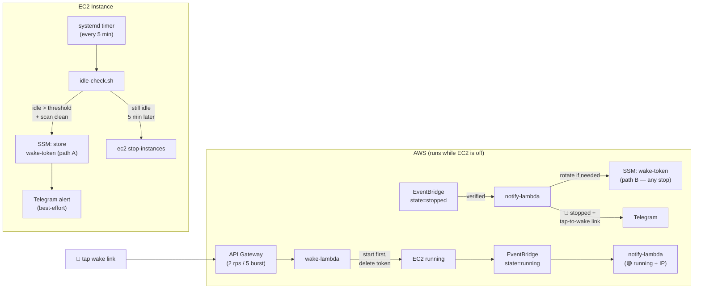

# Idle Shutdown & Wake

Automatically shut down the EC2 instance after an hour of user inactivity. Sends a Telegram alert with a **one-tap wake link** before shutdown. EventBridge notifies you whenever the instance actually stops or starts.

## What's in this folder

```
idle-shutdown/
├── idle-check.py           # Python helper — idle detection, timestamp parsing, state management
├── idle-check.sh           # Bash orchestrator — run by systemd timer every 5 min
├── install-idle.sh         # Idempotent installer (SSM, IAM, Lambdas, API GW, EventBridge, systemd)
├── uninstall-idle.sh       # Tear-down mirror of install-idle.sh
├── wake-lambda/
│   └── index.mjs           # Wake Lambda — validates token, starts instance
├── notify-lambda/
│   └── handler.py          # EventBridge Lambda — Telegram notifications on start/stop
├── systemd/
│   ├── idle-check.service  # systemd oneshot service (hardened, ${INSTALL_USER} placeholder)
│   └── idle-check.timer    # 5-minute timer
└── README.md               # You are here
```

## Architecture

Two independent paths create a fresh wake token. **Any** transition to `stopped` — idle-triggered, manual, or AWS-forced — produces a tappable wake link in Telegram, so you can always get back in.



### Two token-generation paths

| Path | Trigger | Generator | When used |
|------|---------|-----------|-----------|
| **A** | `idle-check.sh` says "idle too long" | on-box bash script | Graceful shutdown sequence |
| **B** | EventBridge sees any `stopped` event | `notify-lambda` | Manual stop, AWS-forced stop, crash, path-A ran but Telegram failed |

Both write to the same SSM key `/openclaw/wake-token`. Path B only rotates the token if the instance is truly stopped (stale-event guard), and only if the existing token is missing or older than the stop timestamp (dedup). **Net effect: any stop → fresh wake link.**

## How it works

1. **Systemd timer** fires every 5 minutes
2. **idle-check.sh** calls **idle-check.py** to scan OpenClaw session JSONL files for the last real user message
3. Activity detection is a **blocklist**: every `role=user` message counts, unless it starts with a known automated prefix (heartbeat poll, `System:`, memory flush). Messages from every chat surface — Telegram, TUI, web, Slack, Discord — are treated uniformly. See **Supported surfaces** below.
4. If idle > threshold and the scan is clean (no file errors, no parse failures): generates a one-time UUID token → stores in SSM → sends Telegram alert → waits one more cycle → stops instance
5. **Wake Lambda** validates the token, starts the instance, *then* deletes the token. If start fails, the token is preserved.
6. **EventBridge** fires on `running`/`stopped` → notify Lambda sends Telegram with IP (on start) or a fresh wake link (on stop)

## Supported surfaces

Anything that writes a `role=user` message to the session JSONL counts as activity, so long as the text doesn't begin with an automated prefix. This includes at minimum:

- Telegram (messages carry `sender_id` metadata — historically the only accepted source)
- OpenClaw TUI (plain text, no metadata wrapper)
- OpenClaw web chat
- Slack plugin
- Discord plugin
- Nostr, MS Teams, Nextcloud Talk, Signal (BlueBubbles), Zalo, Feishu/Lark

**Automated prefixes that do NOT count as activity:**

- `Read HEARTBEAT.md` — heartbeat polls
- `System:` — system notifications
- `Pre-compaction memory flush` — memory compactor
- `[Heartbeat]`, `[System]` — future/legacy variants

Add more via environment variable `IDLE_EXTRA_AUTOMATED_PREFIXES="Prefix A,Prefix B"` in the systemd unit drop-in or `idle-check.sh` environment.

## Install (recommended)

```bash
./install-idle.sh \
  --region us-east-1 \
  --instance-id i-0123456789abcdef0 \
  --chat-id 1234567890 \
  --reuse-openclaw-bot-token
```

The installer is **idempotent** — re-run it to update code or config without creating duplicates. It does **not** start the timer so you can review config first. At the end it prints:

```bash
sudo systemctl enable --now idle-check.timer
```

### install-idle.sh flags

| Flag | Meaning |
|------|---------|
| `--region R` | AWS region (default `us-east-1`) |
| `--instance-id I` | EC2 instance id to manage |
| `--chat-id ID` | Telegram chat id (required — never auto-derived) |
| `--bot-token-ssm-ref P` | Existing SSM SecureString parameter holding the bot token |
| `--bot-token-file F` | File containing the bot token (stored as SecureString) |
| `--reuse-openclaw-bot-token` | Read `.channels.telegram.botToken` from `~/.openclaw/openclaw.json` |
| `--install-user U` | Unix user for the systemd service (default: `$SUDO_USER` or current user) |
| `--dry-run` | Print actions without mutating anything |

Exactly one of `--bot-token-ssm-ref`, `--bot-token-file`, or `--reuse-openclaw-bot-token` must be provided. Chat id is always required explicitly — copying config from one box to another should never accidentally broadcast wake links to the wrong chat.

## Uninstall

```bash
./uninstall-idle.sh --region us-east-1 --instance-id i-0123456789abcdef0
```

Safe to re-run. Use `--keep-ssm` to preserve `/openclaw/wake-config/*` and `/openclaw/wake-token` if you plan to reinstall soon.

## Manual install (advanced)

If you'd rather wire everything up by hand, see [`install-idle.sh`](install-idle.sh) — the script is plain bash and ordered top-to-bottom (SSM → IAM → Lambdas → API GW → EventBridge → systemd). Copy the blocks you need.

Key details the installer gets right and hand-rolled setups often miss:
- `sleep 10` after `iam create-role` — Lambda create fails otherwise (IAM propagation)
- `lambda:InvokeFunction` permissions added **after** the Lambda exists, **before** the caller (APIGW, EventBridge) is reachable
- Wake URL written to SSM **after** the API is created, so `idle-check.sh` picks it up on the next run
- Systemd unit has `${INSTALL_USER}` substituted to the resolved login user, not hard-coded `ec2-user`

## Verify

```bash
# Dry run — logs what would happen, no shutdown
~/.openclaw/workspace/idle-check.sh --dry-run
tail -3 ~/.openclaw/logs/idle-check.log

# Test activity detection logic
bash <path-to-repo>/tests/test-idle-check.sh

# Wake rejects bad tokens
curl -s "$(aws ssm get-parameter --name /openclaw/wake-config/wake-url --query Parameter.Value --output text)?token=fake"
```

**Where's the log?** `$HOME/.openclaw/logs/idle-check.log`. It used to live in `/tmp/idle-check.log` but the systemd unit now sets `PrivateTmp=yes` for hardening — anything in `/tmp` during a service run is namespaced and invisible from outside. The log (and the flock lock) moved to `$HOME/.openclaw/logs/` so you can still `tail -f` them from your shell without sudo.

## Safety model

| Protection | How |
|-----------|-----|
| **Fail-closed scans** | Unreadable files or unparseable timestamps → shutdown blocked |
| **Start before consume** | Wake Lambda starts instance first, deletes token only after success |
| **Telegram is optional** | Broken Telegram config never blocks wake or shutdown |
| **Stale event guard** | Notify Lambda checks actual EC2 state before rotating token |
| **Event dedup** | Duplicate `stopped` events don't overwrite valid wake links |
| **flock** | Prevents overlapping timer runs |
| **Min uptime guard** | 15 min — prevents wake → immediate re-shutdown |
| **API throttling** | 2 req/sec, burst 5 on API Gateway default stage |
| **No hardcoded secrets** | Bot token in SSM SecureString; chat id and URLs in plain SSM |
| **No shell injection** | Telegram sends via env vars, never string interpolation |
| **Systemd hardening** | `NoNewPrivileges=yes`, `ProtectSystem=strict`, `PrivateTmp=yes`, narrow `ReadWritePaths` |

## Cost

~$0/month — Lambda free tier + HTTP API Gateway ($1/million requests) + SSM free tier.

## Threshold tuning

Defaults live in `idle-check.sh`:

| Variable | Default | Meaning |
|----------|---------|---------|
| `IDLE_THRESHOLD_HOURS` | `1.0` | Stop after this much idle time (warn one cycle before) |
| `MIN_UPTIME_HOURS` | `0.25` | Skip shutdown if booted less than this long ago |
| `MAX_NO_ACTIVITY_HOURS` | `1.0` | If no user messages **ever**, stop once uptime exceeds this |
| `LOG_MAX_LINES` | `500` | Log rotation threshold |

The previous default of 0.5 (30 minutes) was too aggressive — agents mid-response would get shut out. 1 hour leaves margin for a long streaming reply or build step.
